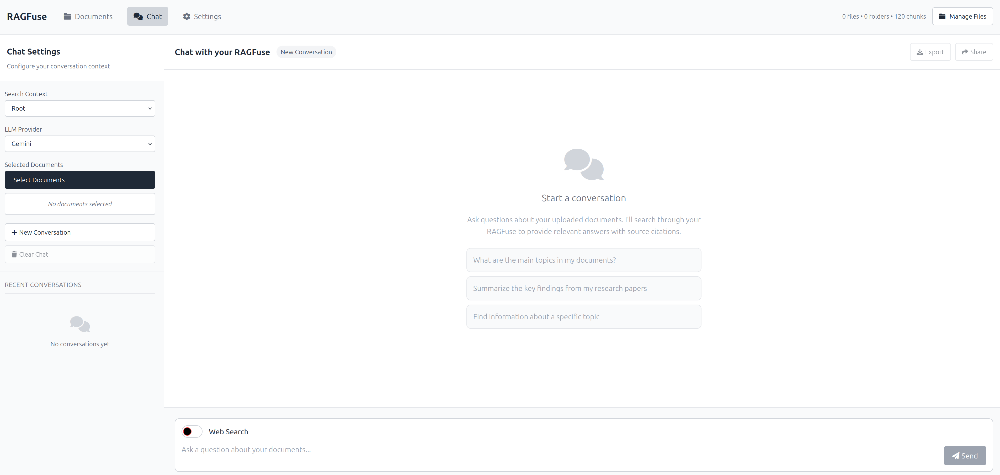

# RAG Application

This is a Flask-based RAG (Retrieval-Augmented Generation) application that allows you to chat with your documents. It uses ChromaDB for vector storage, SQLite for metadata, and supports various LLM providers.

## Features

- **Document Management:** Upload, organize, and delete documents (PDF, DOCX, PPTX, TXT, MD, CSV, JSON). You can create folders and organize your files under different folders.
- **RAG Chat:** Ask questions about your documents, with context retrieved from your RAGFuse.
- **Configurable LLMs:** Support for OpenAI, Claude, Gemini, and Ollama models.
- **Persistent Settings:** LLM API keys and endpoints are saved across application restarts.
- **Document Viewer:** View uploaded PDF documents directly within the browser.
- **Web Search Integration:** Toggle web search on/off for chat queries.
- **Advanced Chunking:** Utilizes `chonkie` with a `NeuralChunker` for intelligent document splitting.

## Chunking

This application uses `chonkie` with its `NeuralChunker` for advanced document chunking. This method intelligently splits documents into meaningful pieces, which can improve the quality of the retrieval and generation process in the RAG pipeline.

## Setup and Running

### Prerequisites

- Docker
- Git

### 1. Clone the Repository

```bash
git clone https://github.com/sajjadriaj/ragfuse
```

### 2. Build the Docker Image (Development)

For development, we'll build an image that allows for live code changes without rebuilding the image every time.

```bash
docker build -t rag-app-dev .
```

### 3. Run the Docker Container (Development)

This command mounts your local project directory and data directories into the container, enabling live updates and data persistence.

```bash
docker run -p 5000:5000 -v "$(pwd)":/app -v "$(pwd)"/chroma_data:/app/chroma_data -v "$(pwd)"/sqlite_dbs:/app/sqlite_dbs -v "$(pwd)"/uploads:/app/uploads -e FLASK_ENV=development --env CHROMA_SERVER_NO_ANALYTICS=1 rag-app-dev
```

- `-p 5000:5000`: Maps port 5000 from the container to port 5000 on your host.
- `-v "$(pwd)":/app`: Mounts your current working directory (the project root) to `/app` inside the container. This allows for live code changes.
- `-v "$(pwd)"/chroma_data:/app/chroma_data`: Mounts a local `chroma_data` directory for ChromaDB persistence.
- `-v "$(pwd)"/sqlite_dbs:/app/sqlite_dbs`: Mounts a local `sqlite_dbs` directory for SQLite database persistence (conversations, document metadata, LLM settings).
- `-v "$(pwd)"/uploads:/app/uploads`: Mounts a local `uploads` directory for uploaded documents persistence.
- `-e FLASK_ENV=development`: Sets Flask to development mode, enabling features like auto-reloading.

**Note:** If you encounter `no such column` errors related to SQLite databases, it might be due to schema changes. You can resolve this by deleting the `sqlite_dbs` directory on your host machine (e.g., `rm -rf ./sqlite_dbs`) and restarting the container. This will recreate the databases with the latest schema (your uploaded files and ChromaDB data will remain).

### 4. Access the Application

Open your web browser and navigate to `http://localhost:5000`.

## Configuration (LLM Settings)

To configure your LLM API keys and endpoints:

1.  Navigate to `http://localhost:5000/settings` in your browser.
2.  Select your desired LLM provider (OpenAI, Claude, Gemini, Ollama).
3.  Enter the required API key or endpoint and model name.
4.  Click "Save Settings".

These settings will be persisted in the `sqlite_dbs` directory on your host machine.

## Screenshots

**Chat Interface**


**Document Management**


**Settings Page**


## Development

After running the Docker container in development mode, any changes you make to the source code on your host machine will be automatically reflected in the running container (Flask will typically auto-reload for Python changes, and static files will be served directly).